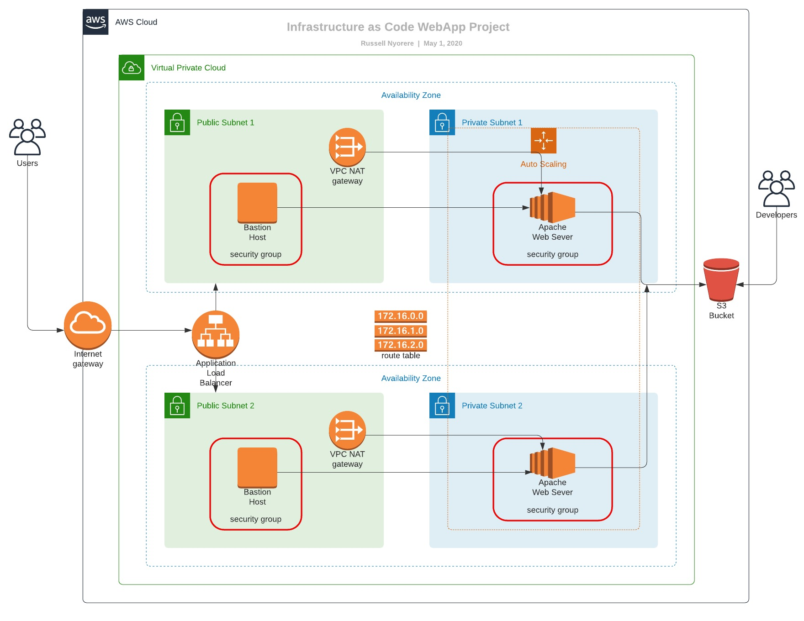

# AWS-CloudFormation

[](https://opensource.org/licenses/MIT)

IaaS - Infrastructure as a Code -> Provisioning of AWS Cloud Resources and Deployment of Udagram Application using CloudFormation Script.

##### Infrastructure Diagram



### Dependencies

##### 1. AWS Account

You would require to have an AWS account to be able to build cloud infrastructure.

##### 2. VS Code Editor

An editor would be helpful to visualize the image as well as code. Download the VS Code editor [here](https://code.visualstudio.com/download).

##### 3. An Lucid Chart Account

A free user-account on [www.lucidchart.com](www.lucidchart.com) is required to be able to draw the web app architecture diagrams for AWS.

To create the AWS Resource, run

```bash
./<bash script create file> <resource name> <cloudformation yaml file> <parameter file for cloudformation yaml file>
```

To update the AWS Resource, run

```bash
./<bash script update file> <resource name> <cloudformation yaml file> <parameter file for cloudformation yaml file>
```

### Web App Link

[Udagram Web App](http://udagr-webap-1ol71qqsy40cj-1689279253.us-west-2.elb.amazonaws.com/)

### License

[MIT](https://opensource.org/licenses/MIT)

### Author

[Russell Nyorere](https://neorusse.github.io/)
